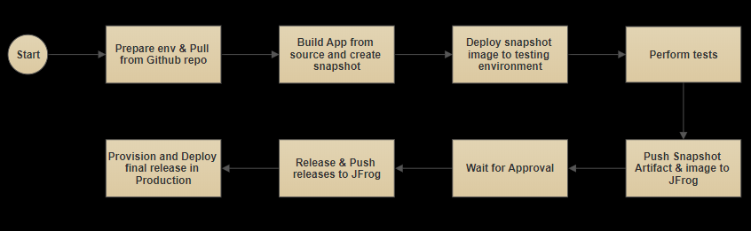
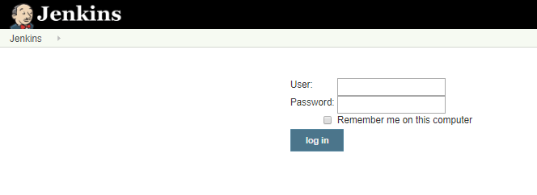

# Hands on with CI/CD with Jenkins Pipeline
## Overview

Jenkins is, fundamentally, an automation engine which supports a number of automation patterns. Pipeline adds a powerful set of automation tools onto Jenkins, supporting use cases that span from simple continuous integration to comprehensive CD pipelines. By modeling a series of related tasks, users can take advantage of the many features of Pipeline:

Code: Pipelines are implemented in code and typically checked into source control, giving teams the ability to edit, review, and iterate upon their delivery pipeline.

Durable: Pipelines can survive both planned and unplanned restarts of the Jenkins master.

Pausable: Pipelines can optionally stop and wait for human input or approval before continuing the Pipeline run.

Versatile: Pipelines support complex real-world CD requirements, including the ability to fork/join, loop, and perform work in parallel.

Extensible: The Pipeline plugin supports custom extensions to its DSL [1] and multiple options for integration with other plugins.

## Agenda

The aim of this lab is to demonstrate how to you provisining environment and application deployment in a Continuous Integration/Continuous Delivery (CI/CD) process using docker containers and Jenkins Pipeline respectively.

The tools used to create the examples for this lab are:
* **Docker** to create infrastructure for this lab
* **SonarQube** for code quality analysis to the CI/CD process.
* **Maven** to set and deploy the Java project.
* **GIT** for source code management and control
* **JFrog Artifactory** is the repository for artifact binaries and docker images.
* **Jenkins** to orchestrate the CI/CD pipeline flow.

### The infrastucture Architecture
Infra image to be added

### Pipeline flow
Now let's explore the CI/CD pipeline flow built for this lab. 

## Hands On!!
### Login to Jenkins Dashboard 
You can skip this section if you are using your own Jenkins Dashboard.

### Creating the Pipeline

